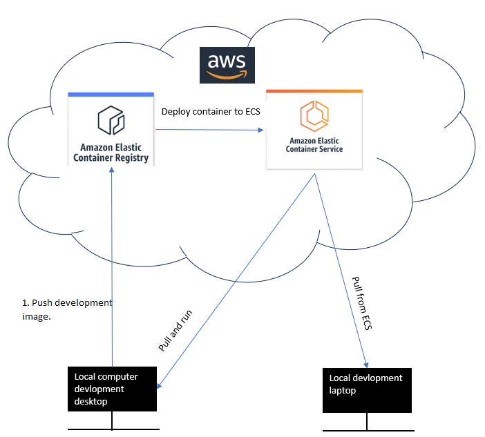

# My AWS SQL Server Container Hosting Strategy For 2023.

## Introduction 

I wanted to use the AWS Elastic Container Registry as I thought I could use my container from there during development in the cloud and deploy later. 

I need to migrate AWS. Why? I want to get out of my apartment to use this container so I can develop on my MacBook Air by day and develop on my home computer in the evening or if it was raining. So I want to develop on more than one machine without having to have 2 different containers on two different computers makes sense?

I want to centralize development in one place. Currently the docker image containing the database sits on my home computer.

## Initializing development

Here's some advise the Bing AI gave me in terms of having a good developer workflow. I still had to make some edits to generalize things:

> 1. Develop Locally: Develop your application on your local machine and containerize it using Docker.
> 
> 2. Build Docker Image: Build a Docker image of your application.
> 
> 3. Push to Registry: AWS ECR, or any other Docker-compatible registry.

Here's the rest upon further prompting.

> 4. Deploy on ECS: Use Amazon Elastic Container Service (ECS) to deploy your application from the Docker image stored in ECR in your environment.

So I realized I could have 2 images. One for development and one for production.

So in a nutshell, both the development and production workflows could look roughly something like this diagram I made. 

So we have solved setting up the initial development environment to host our container. The problem this doesn't solve however is data persistance. AWS has [a great blog](https://docs.aws.amazon.com/AmazonECS/latest/bestpracticesguide/storage.html) about how it works with containers. 

In a nutshell we cannot persist data into the container as containers have their own embedded writeable layer which gets destroyed when the container is terminated. 

Which means we cannot save the container's data inside ECS. We have to store the container's data outside of it elsewhere in another service. We may need this in case we wish to update the database schema and preserve it's data.

## Persisting data to storage and the pain of choice

At a minimal, you then need to ask how to manage updates to the database schema pulled from ECS. We have at least 3 options available for this: 

1. We could use a third party cloud storage provider.   
2. We could use one of AWS's cloud storage services [shown here](https://aws.amazon.com/products/storage/)    
3. WARNING (very unlikely to be feasible). We could potentially persist the data to local storage and avoid cloud storage all together. Few have figured out how yet except [LocalStack](https://docs.localstack.cloud/user-guide/aws/feature-coverage/) who say you can only use their APIs with ECS in their Pro package which is $35USD a month. 

After much research I have chosen to use Amazon Simple Storage, Also known as (S3) or an(S3 Bucket).  

It's apparently their best seller in terms of scalability, security and availability. The great thing about S3 is it's cheaper than most others and serves our purpose which is to do data dumps to S3 and pull them down to our local machine so we can do updates to the data schema if need be. 

You also set the desired storage classes for your S3 instance. So storage classes are basically there for whatever user case you may have. 

So you could have classes for frequently accessed objects which would be more expensive like S3 Standard. And objects accessed infrequently would fall under classes like S3 One Zone-IA. 

AWS mention [here](https://docs.aws.amazon.com/AmazonS3/latest/userguide/storage-class-intro.html) that:

> S3 One Zone-IA – Use if you can re-create the data if the Availability Zone fails, and for object replicas when configuring S3 Cross-Region Replication (CRR).

I may make changes to my personal database schema.
But I haven't updated my database in a long time so this section makes sense for me. 

Of course in a real industry you would likely use a higher class of S3 and not this class even though it's the cheapest. Here's why.

> S3 One Zone-IA - Amazon S3 stores the object data in only one Availability Zone, which makes it less expensive than S3 Standard-IA. However, the data is not resilient to the physical loss of the Availability Zone resulting from disasters, such as earthquakes and floods.

## The completing workflow

If we continue from our Initializing development heading we mentioned a workflow. We are now on step 5 of that workflow.

5. Now from ECS you can pour the container data into your S3 bucket. 
6. From S3 you can pour the data to your local computer, manipulate the database schema, containerize it and begin the iteration again of uploading it to AWS Elastic Container Registry.

And so the result would be like this.